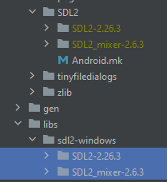
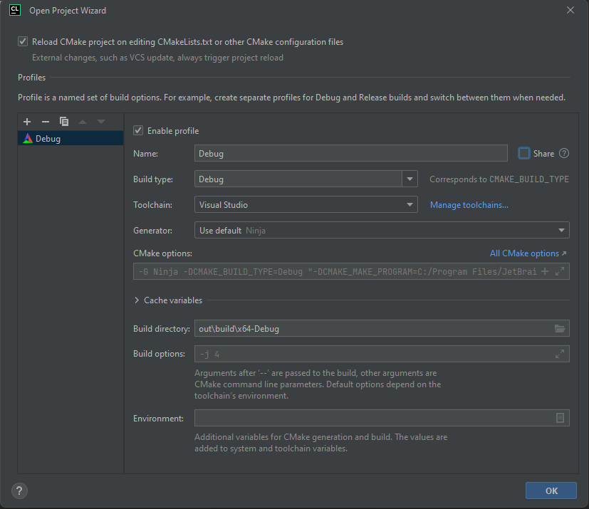
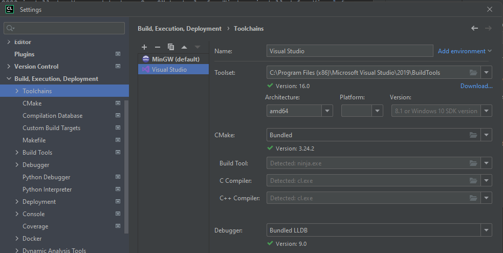

# Building Tiberius

To build you need:

- a compiler: gcc, clang, Visual Studio
- `cmake`
- `SDL2`
- `SDL2_mixer`
- `libpng` (optional, a bundled copy will be used if not found)

## Compiling using clion on Windows
Make sure you have Microsoft Visual Studio 2022 installed.  You need to have C++ CMake tools for Windows installed for Visual Studio that you can install via Visual Studio Installer as an optional package.

1) Clone the code using git
2) Move the windows SDL2 source from libs -> SDL2. 
3) 
4) Open the project in CLion and setup the project
5) 
6) Setup clion to use the x64 architecture 
7) 
8) Compile the project
9) Move the Windows dlls from SDL2 into the out\build\x64-debug folder
10) Launch the game

## CMake options
* -DSYSTEM_LIBS=OFF - use the bundled copies of optional libraries even if a system version is available
* -DTARGET_PLATFORM - the platform you're building for. Can be vita, switch, android or emscripten. Please refer to the specific building pages for more detailed instructions
* -DDRAW_FPS=OFF - whether to show the current fps on the city scree